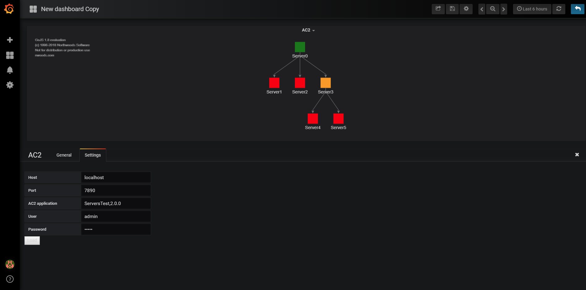

## AC2 Panel Plugin for Grafana
* AC2 Panel Plugin allows AC2 map visualization
* No need to create a grafana datasource
* Fill the settings form with the right information to view the AC2 map application

